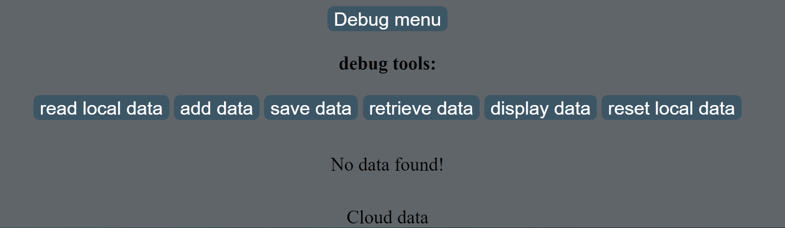

# 

##### What is this?

[Go to my project in github!](https://niv200.github.io/pre-course-2021-final-boilerplate/src/index.html)

This is a todo list app for the precourse of scaleup velocity.\
a task can be added via the input box, after that, chose your priority (ranges from 1 to 5, where 5 is most important.)\
each task can be removed or _"ticked"_ off, removing the task simply mean eliminating it from the \
todo list, whilst ticking a task means it text turns strikethrough and grey, which indicates that you \
may have done it, or that you want to return it for whatever reason.

##### Whats in this app?

- Way to add tasks and priorities to each task
- Each task can be edited individually and be changed on the go.
- Tasks can be "ticked", for explanation look above.
- Undo button
- Reset button
- Sort button
- Delete task button
- DARK THEMEEEE

##### Puppeteer

This code uses my own puppeteer class to test itself out!\
look at MyTests.test.js for further information.\
do note, it uses preset values to check if the values are
matching what is expected, meaning the data set for the puppeteer \
cannot be changed nor modified unless you are also willing to modify the puppeteer class.\
The puppeteer will run 16 tests, checking for the following:

- Adding first task
- Checking if tasks left counter is increased
- Checking if tasks completed stayed same since no task was completed yet.
- Checking if task can be removed
- Check if undo returns deleted task
- Adding 2 more tasks with different priorities
- Adding 2 more tasks and ticking them done!
- Checking if tasks left is 4 since now we have 6 tasks, 2 of which are ticked and considered 'done' so only 4 left
- Checking if tasks completed increased since we added ticked tasks
- Checking if reset button works and deleted ticked tasks
- Checking if completed tasks went down by 1 since we hit reset and the counter should be reset
- Checking if tasks left is now 4 again
- Checking that undo does NOT work after reset (also gets reset)
- Checking if sort button works! (First state, increasing)
- Checking if sort button works! (Second state, decreasing)
- Check if task can be marked

# 

##### Explanation for buttons

**Text box**
This box contains your task text and info, this can later be modified and changed.
**Importance**
This lets your choose your priority for your task, ranging from 1 - 5.
**Add button**
This button adds your task into the todo list. be sure to give it some text and choose a priority! else youll be alerted according to the reasons why.
**Dark theme**
Click this to change your task list into dark mode :)

# 

##### Debug

Since I stayed up all night and almost figured it out but not really, I added a debug\
 section to show that I am able to use json and jsonbin to store and read values and sets.\
To open the debug menu, press the debug button, a following section will be revealed.

**Debug buttons**

- Read local data - Shows you the current data stored in an array, this is stored locally and will reset with every refresh.
  since its in an array, you can look up in the console to see the objects are in the array and their values.
- Add data - this button simply adds a simple task object into the local data, after hitting this button, hit read local data and you will see the object. for further detail look at your console.
- Save data - this button allows your to save the local array into jsonbin online, after hitting this button no output will be shown, to access the data see next buttons.
- Retrieve data - this buttons allows your page to read the data from jsonbin.io and put it into the local data array set.
- Display data - this shows the data stored in jsonbin.io, it will show you a promise in the html page, however itll show your the inner objects in the console.
- Reset local data - a button to reset local data, that way you can check if you retrieved your data from online or locally.

Press the read button, youll see theres no data,\
now press add data twice, this will add 2 objects into the local array, pressing read again will\
show you that two objects were added.\
when you press save data the data is being sent into jsonbin.io, so by resetting the local data, one can check if the retrieve data button works\
by clicking on it which will dump the data into the local array.\
then, press read local data.\

_This is a proof of concept that I can work with json and jsonbin.io, however I did not manage to introduce it into my todo list._
